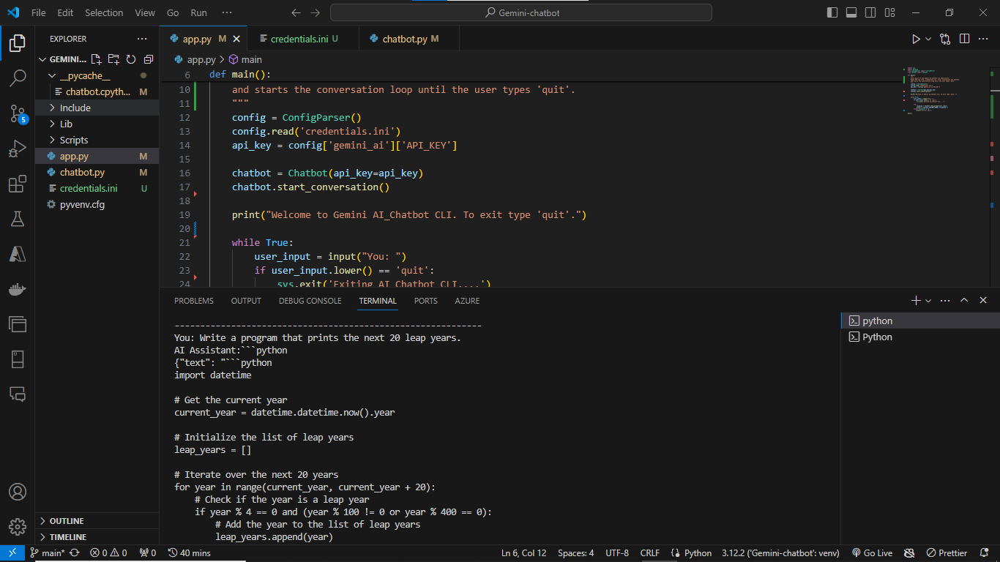

## AI Chatbot with Python and Google Gemini API

An intelligent chatbot using Python and Google's Gemini AI API.

**Key Features:**

* Google Cloud's powerful tools for AI chatbot development.
* Seamless integration with the `generativeai` API.
* Gemini AI model to craft a responsive chatbot.

**What You Can Achieve**

This project provides a foundation for building a functional AI chatbot that can engage in conversations.

**Getting Started**

* Python installation required ([https://www.python.org/downloads/](https://www.python.org/downloads/))
* A Google Cloud account is necessary ([https://cloud.google.com/](https://cloud.google.com/))

**Further Exploration**

This project offers a springboard for you to delve deeper into AI chatbot development. Consider exploring areas like:

* Advanced conversation management techniques
* Integration with additional tools and services
* Customization and personalization of the chatbot

**Contributing**

We welcome contributions to this project! Feel free to submit pull requests for improvements or new features.
